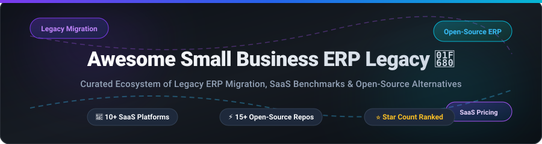

  

  
  
  
  
  
  
  

---

# 🚀 Awesome Small Business ERP Legacy & Modern Open-Source Ecosystem

> **A Curated Directory of Legacy ERP Software Benchmarks, SaaS Accounting Platforms, and Production-Ready Open-Source Alternatives.**

*Focused on SMB accounting, legacy ERP migration pathways, TCO evaluation, and open-source software adoption.*

📅 **Last updated: October 2026**

---

## 📌 Executive Overview

This repository tracks legacy **Enterprise Resource Planning (ERP)** platforms that small and mid-sized businesses (SMBs) still rely on — alongside modern **open-source ERP and accounting alternatives** designed to replace them. Legacy systems often run on aging infrastructure, lack REST/GraphQL APIs, carry high annual maintenance fees, and restrict custom development. Migrating away requires careful data mapping, process analysis, and selecting a feature-complete target platform.

### Key Focus Areas:
- 🏢 **Legacy ERP Benchmarking**: Microsoft Dynamics NAV, Dynamics GP (Great Plains), SAP Business One, Sage Pastel, QuickBooks Desktop Enterprise, MAS 90, Peachtree, MYOB Premier, and Exact Globe.
- ⚡ **Open-Source Dominance**: High-star open-source alternatives like **Odoo Community**, **ERPNext**, **Dolibarr**, **Firefly III**, **Invoice Ninja**, and **Akaunting** offering full financial, inventory, and MRP modules with zero vendor lock-in.

---

## 📑 Table of Contents

- [🏢 SaaS & Hosted Platforms](#-saas--hosted-platforms)
- [⚡ Open-Source GitHub Projects](#-open-source-github-projects)
- [📊 Migration Framework & Evaluation](#-migration-framework--evaluation)
- [🤝 How to Contribute](#-how-to-contribute)
- [📜 Disclaimer](#-disclaimer)
- [⭐ Star History](#-star-history)
- [💖 Support & Sponsorship](#-support--sponsorship)

---

## 🏢 SaaS & Hosted Platforms

> 📈 **Market Size & Structure**: The global Small Business ERP & Accounting software market is estimated at **$54.2 Billion** (projected to reach **$98 Billion** by 2032 at a 9.8% CAGR). The market is **highly fragmented**, split between legacy desktop providers (Sage, Intuit, MYOB, Exact), proprietary cloud suites, regional accounting tools, and an expanding ecosystem of open-source ERP providers.

Below is a comparison of major SaaS and legacy hosted ERP platforms, sorted by **Parent Company Size / Valuation (Descending)**:

| Product Name | Parent Vendor | Company Valuation / Revenue | Starting Tier Pricing | Free Tier / Trial Limit | Legacy Focus & Feature Overview |
| :--- | :--- | :--- | :--- | :--- | :--- |
| **[Microsoft Dynamics NAV (Legacy)](https://www.microsoft.com/en-us/dynamics-365/products/business-central)** | Microsoft | $3.1 Trillion | $70.00/user/month (Essentials) | 30-day free trial (up to 25 seats) | Legacy SMB ERP succeeded by Dynamics 365 Business Central. Often deployed on legacy SQL Server infrastructure. |
| **[Great Plains (Dynamics GP)](https://www.microsoft.com/en-us/dynamics-365/products/gp)** | Microsoft | $3.1 Trillion | $5,000.00/license + $220/user/yr | 30-day free trial (partner sandbox) | On-premise legacy ERP with phased Microsoft support and push toward cloud Business Central. |
| **[SAP Business One Legacy](https://www.sap.com/products/erp/business-one.html)** | SAP SE | $280 Billion | $56.00/user/month (Starter Cloud) | 30-day free trial (guided cloud environment) | Classic SMB ERP with legacy on-premise SQL/HANA deployments requiring cloud migration planning. |
| **[QuickBooks Desktop Enterprise](https://quickbooks.intuit.com/desktop/enterprise/)** | Intuit | $180 Billion | $1,069.20/year (1 User Gold) | 30-day free trial (up to 5 active users) | Dominant desktop SMB accounting system with industry-specific inventory, payroll, and reporting. |
| **[Sage Pastel](https://www.sage.com/en-za/products/sage-pastel/)** | Sage Group | $12 Billion | $15.00/user/month (Sage 50 Pastel) | 30-day free trial (1 user) | Widely adopted legacy desktop accounting and ERP platform in Southern Africa and regional markets. |
| **[MAS 90 (Sage 100)](https://www.sage.com/en-us/products/sage-100/)** | Sage Group | $12 Billion | $1,320.00/user/year ($110/user/mo) | 30-day free trial (available via partner demo) | Sage's legacy Windows-based SMB ERP for distribution, manufacturing, and general accounting. |
| **[Peachtree Complete (Sage 50)](https://www.sage.com/en-us/products/sage-50/)** | Sage Group | $12 Billion | $58.92/month ($589/year Pro) | 30-day free trial (1 user full features) | Dominant historic US small business accounting desktop tool prior to cloud adoption. |
| **[DacEasy](https://www.daceasy.com/)** | Sage Group | $12 Billion | $350.00/year (legacy renewal tier) | 30-day free trial (historical demo build) | Historically significant 1990s SMB accounting system, now largely legacy/discontinued. |
| **[MYOB Premier](https://www.myob.com/)** | MYOB (KKR) | $2.5 Billion | $60.00/month (MYOB Business Pro) | 30-day free trial (full functionality) | Popular legacy multi-currency accounting & ERP platform in Australia and New Zealand. |
| **[Exact Globe](https://www.exact.com/)** | Exact (KKR) | $2.0 Billion | $55.00/month (Exact Online Essentials) | 30-day free trial (up to 5 users) | Netherlands-based ERP platform with extensive on-premises desktop legacy installations. |

---

## ⚡ Open-Source GitHub Projects

Open-source ERP software offers full database ownership, zero seat-based pricing, and deep customization capabilities.

The repositories below are sorted by **GitHub Stars_Count (Descending)**:

- **[Odoo Community](https://github.com/odoo/odoo)**  — **The most comprehensive open-source ERP system**, LGPL-3.0 licensed. Offers 80+ official modules covering CRM, sales, purchasing, inventory, manufacturing, accounting, HR, and POS. Supported by 50,000+ community modules and a global partner network. Best for businesses wanting maximum ecosystem scale.
- **[Maybe Finance](https://github.com/maybe-finance/maybe)**  — **Modern open-source personal finance and asset management dashboard**, AGPL-3.0 licensed. Centralizes bank accounts, tracks net worth, calculates financial metrics, and manages investments via Docker self-hosting.
- **[ERPNext](https://github.com/frappe/erpnext)**  — **100% free and open-source ERP with no feature gates**, GPLv3 licensed. Built on Python/Frappe framework. Includes accounting, HR, CRM, helpdesk, and first-class manufacturing (BOMs, work orders, MRP, quality inspection) without per-user licensing fees.
- **[Firefly III](https://github.com/firefly-iii/firefly-iii)**  — **Self-hosted personal and micro-business finance manager**, AGPL-3.0 licensed. Features double-entry bookkeeping, rule engines, budgeting, multi-currency support, and recurring transaction tracking.
- **[Invoice Ninja](https://github.com/invoiceninja/invoiceninja)**  — **Leading open-source invoicing, time tracking, and expense software**, AGPL-3.0 licensed. Offers client portals, online payment gateways, recurring invoicing, and quote workflows built on Laravel and Flutter.
- **[Akaunting](https://github.com/akaunting/akaunting)**  — **Web-based accounting software for small businesses**, GPL-3.0 licensed. Built with Laravel and Vue.js. Provides double-entry accounting, customer billing, expense tracking, and a rich app store marketplace.
- **[Dolibarr](https://github.com/Dolibarr/dolibarr)**  — **Simple, modular open-source ERP and CRM**, GPL-3.0 licensed. Highly lightweight PHP stack ideal for freelancers, non-profits, and small businesses (1–15 employees) needing fast setup and quick learning curve.
- **[Frappe Books](https://github.com/frappe/books)**  — **Free desktop accounting app for small businesses and freelancers**, MIT licensed. Built with Electron, Vue.js, and SQLite. Offers offline double-entry ledger, invoicing, P&L reports, and balance sheets.
- **[GnuCash](https://github.com/Gnucash/gnucash)**  — **Established double-entry accounting application**, GPL licensed since 2001. Supports stock/bond portfolios, scheduled transactions, OFX/QIF imports, and financial reports.
- **[metasfresh](https://github.com/metasfresh/metasfresh)**  — **Enterprise-grade open-source ERP focused on distribution and wholesale**, GPLv3 licensed. Features advanced supply chain tracking, FIFO/FEFO inventory control, and automated mass-processing.
- **[Apache OFBiz](https://github.com/apache/ofbiz)**  — **Apache 2.0 licensed suite of enterprise business applications**. Java-based framework providing ERP, CRM, e-commerce, supply chain management, and warehouse management.
- **[iDempiere](https://github.com/idempiere/idempiere)**  — **Community-powered OSGi enterprise ERP**, GPLv2 licensed. Evolved from Compiere/Adempiere, offering ERP, CRM, SCM, and POS modules for mid-sized enterprises.
- **[LedgerSMB](https://github.com/LedgerSMB/LedgerSMB)**  — **Double-entry accounting and ERP system for SMBs**, GPL licensed. Built on PostgreSQL with strict financial audit trails, inventory, and payroll integrations.
- **[MyCompany](https://github.com/lsfusion-solutions/mycompany)**  — **Self-hosted unified ERP and CRM**, Apache-2.0 licensed. Uses single database architecture for sales, inventory, retail POS, and manufacturing without inter-module synchronization delay.
- **[Zedgerr](https://github.com/vMawk/Zedgerr)**  — **Self-hosted invoicing and bookkeeping tool**, MIT licensed. Designed for international freelancers with VAT/GST handling, mileage logging, and multi-currency ledgers.

---

## 📊 Migration Framework & Evaluation

When transitioning from legacy desktop ERPs (QuickBooks Desktop, Dynamics NAV, Sage 50):

1. **Ecosystem & Scalability**: Choose **Odoo Community** if you anticipate upgrading to Enterprise for advanced automation, or **ERPNext** if you require 100% free manufacturing and MRP modules without feature gates.
2. **Ease of Deployment**: Select **Dolibarr** or **Akaunting** for low resource usage, web accessibility, and simple module management.
3. **Desktop & Offline Accounting**: Choose **Frappe Books** or **GnuCash** when multi-user cloud access is unnecessary and local SQLite storage is preferred.
4. **Data Extraction & Process Mapping**: Legacy migrations require exporting database schemas (MSSQL, Pervasive PSQL, Access), cleansing customer/ledger masters, and running parallel accounting runs prior to cutover.

---

## 🤝 How to Contribute

Contributions are welcome! Please follow these guidelines:

1. Fork the repository.
2. Edit `README.md` following the tabular or star-ranked list format.
3. Ensure specific starting prices and free tier limits are verified.
4. Submit a Pull Request with a summary of changes.

---

## 📜 Disclaimer

- This directory is a **community-curated list** provided for educational and benchmarking purposes.
- Legacy software versions may lack security updates and compliance standards (e.g., e-invoicing, GoBD, ZUGFeRD).
- Open-source self-hosting requires infrastructure maintenance, backups, and security patching.

---

## ⭐ Star History

---

## 💖 Support & Sponsorship

If you find this curated ecosystem directory helpful for your ERP evaluation or legacy migration project, please consider supporting the project:

- ⭐ **Star this repository** to help others discover it!
- 🔀 **Fork & Share** with fellow developers, IT leaders, and business owners.
- ☕ **Sponsor ongoing research** via [GitHub Sponsors](https://github.com/sponsors/ishandutta2007).

---

*Curated with ❤️ by [ishandutta2007](https://github.com/ishandutta2007/Awesome-Awesome-Awesome)*
